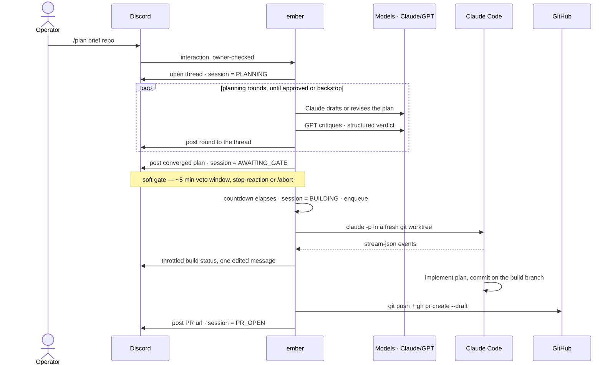

# ember — architecture

How ember is put together: the components, how data flows between them, the
session state machine, the data contracts, and the telemetry. For *why* the
big decisions were made, see the [ADRs](adr); for the phased build narrative,
see [PLAN.md](../PLAN.md) and the [retrospective](retrospective.md).

ember is one always-on .NET host process. A `/plan` invocation becomes a
long-lived **session** — one Discord thread, one SQLite row — that moves
through a fixed state machine: a Claude/GPT planning loop, a soft approval
gate, a headless build, and a draft-PR handoff.

> The diagrams below are SVGs rendered from the Mermaid sources in
> [`diagrams/`](diagrams/). To change one, edit its `.mmd` file and re-render
> with [`mermaid-cli`](https://github.com/mermaid-js/mermaid-cli).

---

## 1. System dataflow



Every arrow into `SessionStore` is the durability seam: the session row is the
source of truth, so the pipeline survives a process restart. The in-memory
drivers (the planning loop, the build queue) do not — see §2 and ADR 8.

---

## 2. Session state machine

One session, one Discord thread, one `sessions` row. Four active states and
two terminal off-ramps.



Restart behaviour differs by state, and the difference is deliberate:

- **`AWAITING_GATE`** is the only active state that *survives* a restart. The
  gate is just a persisted deadline (`gate_expires_at`); `GateService` re-arms
  a window that elapsed while ember was down, never auto-firing it (ADR 5).
- **`PLANNING`** and **`BUILDING`** are driven by in-memory tasks that the
  restart kills. `RecoveryService` marks them `FAILED` rather than resuming
  non-idempotent work (ADR 8).

`gate_reason` (`approved` · `round_cap` · `stalled`) rides on the session so a
plan forced forward by a backstop is never shown as endorsed.

---

## 3. End-to-end sequence — `/plan` to draft PR



`/abort` and `/status` are not shown: `/status` reads the session row at any
time; `/abort` cancels whatever is in flight for the thread (loop, gate, or
build) per the state machine in §2.

---

## 4. Hosted services and composition

ember registers four `IHostedService`s. Start order matters once:
`RecoveryService` runs first so the database is consistent before any other
service acts on it.



`BuildQueue` is registered both as a singleton (so `GateService` and
`AbortCommand` can reach it) and as the hosted service that drains it.

---

## 5. Tech stack



| Layer | Choice | ADR |
|---|---|---|
| Control surface | Discord, thread-per-session | [1](adr/0001-discord-control-surface.md) |
| Runtime | C# / .NET 9 | [2](adr/0002-csharp-dotnet-agent-framework.md) |
| Model access | one OpenAI-compatible `IChatClient` | [3](adr/0003-openai-compatible-ichatclient.md) |
| Builder | headless Claude Code via CLI | [4](adr/0004-builder-headless-claude-code.md) |
| Loop + gate | critic-driven, resumable soft gate | [5](adr/0005-critic-driven-loop-and-soft-gate.md) |
| Build throttle | global FIFO queue | [6](adr/0006-global-fifo-build-queue.md) |

---

## 6. Data contracts

### 6.1 `sessions` — the SQLite table

The single source of truth. One row per session, keyed by Discord thread id.


### 6.2 Critic verdict — model output contract

The critic model is instructed to return **only** this JSON object:

```json
{
  "assessment": "<one-sentence overall read>",
  "issues": [
    { "severity": "blocking|major|minor", "summary": "<the problem>", "fix": "<concrete fix>" }
  ]
}
```

ember derives the verdict from it (`CriticVerdict`): `OpenIssues` =
issues at `blocking` or `major`; `Approved` = no open issues. A malformed
response is retried once, then treated as **not approved** — a parse failure
must never read as success. The loop continues while open issues remain.

### 6.3 Builder event stream — `claude` stdout contract

`BuilderRunner` parses the headless builder's JSONL stdout. It consumes four
event types and ignores the rest:

| `type` | ember reads | Used for |
|---|---|---|
| `system` | init marker | "starting the builder…" |
| `assistant` | `message.content[]` — `text`, `tool_use` (name + input) | tool-action count, last activity line |
| `result` | `is_error`, `subtype`, `num_turns`, `total_cost_usd` | success/fail decision, final summary |
| `user` | tool results | (ignored — digest only) |

The digest is rendered into **one** Discord status message, edited on a ~4 s
throttle (never a message per event — Discord rate limits).

### 6.4 Plan snapshot artifact

At gate entry the converged plan is frozen into `plan_snapshot`. It is the
single downstream source of truth:

- shown at the gate,
- written into the build worktree as `.ember/PLAN.md` — the builder consumes
  this, never Discord history,
- used verbatim as the draft-PR body.

`.ember/` is kept out of the target repo via its shared `.git/info/exclude`,
so no tracked `.gitignore` churn lands in the operator's repo.

### 6.5 Telemetry signals

| Signal | Name | Tags |
|---|---|---|
| span | `command /<name>` | — |
| span | `plan.session` | `ember.repo` |
| span | `plan.round` | `ember.round` |
| span | `gate.fire` | `ember.gate_reason` |
| span | `build.run` | `ember.repo`, `ember.thread_id`, `ember.branch`, `ember.build.outcome` |
| span | `pr.open` | `ember.branch`, `ember.pr_url` |
| span | planner / critic model call (nested in `plan.round`) | `gen_ai.*` — model, token usage, duration |
| counter | `ember.commands.handled` | `command` |
| counter | `ember.builds.completed` | `outcome` |
| histogram | `ember.build.duration` (s) | `outcome` |

---

## 7. Observability — trace shape

A session's lifecycle is emitted as **four separate traces**, not one. The
gate countdown and the build span minutes and can cross a restart, so a single
long-lived span is not viable — see ADR 7.



The traces correlate by tag (`ember.repo`, `ember.thread_id`), not by a shared
parent span. `dotnet run -- demo` emits this exact shape synthetically — see
the [README](../README.md#observability).

---

## 8. Trust boundary

The builder executes model-written code on the host *by design*. Isolation is
structural, not sandboxed:

- **Per-build git worktree** — the builder works only inside a fresh worktree
  on its own branch; it never touches the operator's working tree or `main`.
- **ember owns the remote** — the builder gets no push or PR credentials.
  Commit happens inside the worktree; `push` and `gh pr create` are ember's.
- **Draft PR only** — output is always a draft PR, never an auto-merge.
- **Soft-gate veto** — nothing builds until the operator's countdown elapses
  without an abort.
- **Owner lock** — all three commands accept only the configured operator id.

True network sandboxing of the builder is a deliberate non-goal for v1 (it
would break dependency restore — `dotnet` / `npm` / `nuget`).
